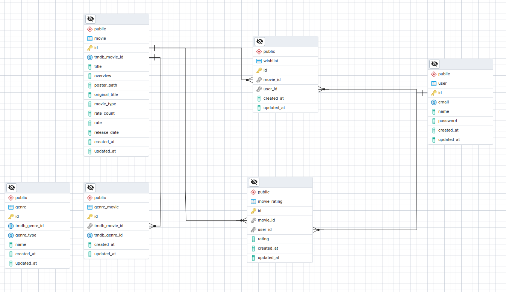

# TMDB
## Database Schema
 

## Setup
### Run the app without docker

```bash
$ npm i
$ cp .env.sample .env # set your variable in env
$ npm run migrate:all
$ npm run start
$ npm run test:e2e # to run test
# you can use open http://localhost:9000/docs for docs
```
### Run the app with docker

```bash
$ cp .env.sample .env
$ docker-compose up --build
$ docker-compose exec tmdb_app npm run migrate:all
# after 3 min the database will synced with tmdb
# you can use open http://localhost:9002/docs for docs
```
## Built with
* [unified-errors-handler](https://github.com/AhmedAdelFahim/unified-errors-handler) (my own package to handle errors you can check it)
* [objectionjs-repository](https://github.com/AhmedAdelFahim/objectionjs-repository) (my own package (repository design pattern))
* nestjs
* postgres
* redis
* knexjs